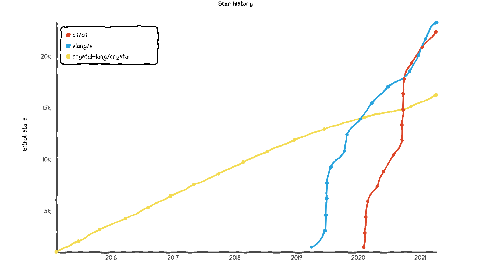

## V语言学习笔记

利用业余时间体验了V语言。边看，边动手，边记录，所以有了这个V语言学习笔记。

### 前言

这是一门新发布的语言由[Alexander Medvednikov](https://github.com/medvednikov)发起，开源时间为2019年6月22日。目前star数已有2万多，贡献者已有5百多人，快速迭代开发中。

目前，语言的稳定性和成熟度肯定还需要时间完善，不能期望太高。不过，作者还是实现了很多不错的语言特性。也很佩服他有勇气，有能力，又开发了一门新语言，并且很努力地全职开发，快速更新。

V语言还算是很有潜力的一门新语言，喜欢的人不妨抽点时间跟进一下，一起跟着V语言成长。

V语言官网： [https://vlang.io/]( https://vlang.io/)

V语言代码库：[https://github.com/vlang](https://github.com/vlang)

V语言社区dicord：https://discord.com/invite/vlang

V语言学习笔记： https://github.com/lydiandy/vlang_note

V语言学习笔记-gitbook阅读地址： https://lydiandylin.gitbook.io/vlang

---

### **为什么喜欢V**

V语言感觉就是 **go+rust+c** 的结合体，吸收了这三者的优点，不过像go更多一点。

V语言实现了自举，编译器把V代码生成C代码，然后再调用gcc或者clang来编译生成的C代码。

V语言的语法看着，写着都很舒服，比go和rust都好，吸收了go和rust各种简洁和优秀的特性。

有个关于V语言的评论挺有意思，原文是这样：

"If Go and Rust had a baby it would be this language. Grandpa C should be proud."

"如果Go和Rust有一个孩子的话，那应该就是V，他的爷爷C也挺自豪有这么一个孙子。"

对于V语言主要还是看重：

- 简洁，干净的语法，看起来，写起来都很舒服。

- 没有GC，编译快，生成的执行文件很小，执行很快。

- 语言特性介于go和rust之间，比go多了一些缺失的核心特性，不会显得单调无聊；又比rust简单得多，不会显得过于复杂，难以掌握。

- 由于编译生成C代码，可以很方便地跟已有的C代码库集成，快速使用C成熟丰富的代码库。

- 安全，没有null/nil，没有全局变量，变量默认只读，边界检查，没有未定义行为。

感觉V才是 "**better C**"。

当然，目前V语言的阶段还是比较早期的，还不够稳定。

不过，开发的速度挺快的，新语法特性一直在完善。

即使1.0发布了，也有挺长的路要走，毕竟一门编译语言的发展是按年来计算的。

### 目标

作者希望把V变成一个**通用编程语言**：

- 能够像C那样，成为新一代的主流静态类型语言。
- 能够像C/C++/rust那样，用来开发操作系统，数据库，浏览器等核心系统。
- 能够像shell/python那样，用来写系统脚本。
- 能够像python那样，用来写机器学习。
- 能够像go/java那样，用来写网络应用。
- 能够像C/C++那样，用来写GUI图形框架。
- 能够像ts那样，用来编译生成js前端代码。

一开始看到作者的这个目标也是被吓了一跳。

目标挺远大，做到了就无比牛逼，也意味着工作量巨大，实现难度会比较大，周期会比较长。

### 官方吉祥物

还挺可爱的，网址：https://github.com/vlang/v-mascot

### github关注度

从V语言的github star增长曲线图来看，V语言还是受到很多开发者的关注，star数量增长很快。

### **一起完善**

目前V语言的中文文档比较少，如果有兴趣一起学习，记录V语言的各种语言特性及标准库，欢迎提交pull request。
