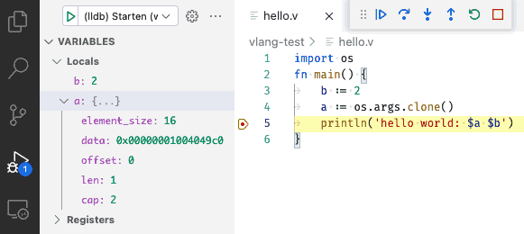

## V代码调试及错误排查

实际使用V开发的过程中，有时会碰到一些奇怪的，难以定位的报错。

有些是自己代码本身的写法有问题，有一些确实会碰到编译器的bug。

如何快速地对错误进行定位和处理，会节省很多无谓的时间浪费。

从原理上来说V编译器的过程是: V代码=>C代码=>可执行文件。

正常来说V编译器会尽可能地发现编译错误，并给出比较明确的提示哪里出错了。

可是如果V编译器在生成C代码的过程中，生成有错的C代码，导致C编译器编译出错，就需要进一步的调试跟踪选项来定位错误。

### vscode调试插件

除了安装V插件外，还需要安装C/C++插件：

https://marketplace.visualstudio.com/items?itemName=ms-vscode.cpptools

安装好C/C++插件后，开始配置：

- 打开菜单：运行->启动调试，第一次使用会弹出配置环境，配置环境为C++(GDB/LLDB)，然后将配置launch.json文件为：

  ```json
  {
      "version": "0.2.0",
      "configurations": [
          {
              "name": "(lldb) 启动",
              "type": "cppdbg",
              "request": "launch",
              "program":  "${fileDirname}/${fileBasenameNoExtension}", //要改为这个
              "args": [],
              "stopAtEntry": false,
              "cwd": "${fileDirname}",
              "environment": [],
              "externalConsole": false,
              "MIMode": "lldb"
          }
      ]
  }
  ```
  
- 第一次配置好以后，再次点击运行->启动调试，就会显示调试视图。

- 在启动调试之前，要先用V编译器把源代码编译为带调试信息的二进制文件，然后再开始启动调试。

  ```shell
  v -g main.v #-g选项就是生成带调试信息的二进制文件
  ```

  也可以将编译为带调试信息的二进制文件这一步配置到task.json中，这样就不用每次都用手工输入命令行了。

  ```json
  {
  			"label": "v build_debug",
  			"type": "shell",
  			"command": "v -g ${file}"
  		},
  ```

- 启动调式后，就可以看到C调试信息的输出。

- 还可以在代码中插入断点，查看变量值，单步调试等常规调试的操作。

  

### C后端调试

常用编译带调试选项：

- -g

  不做代码优化，加入更多的调试信息在生成的可执行文件中，编译器会强制把v源代码中的行号加入到跟踪堆栈stacktraces中。

  如果启用了-g，断点要打在V源代码上

- -cg

  不做代码优化，加入更多的调试信息在生成的可执行文件中，编译器会强制把C源代码中的行号加入到跟踪堆栈stacktraces中,一般会配合-keepc使用，每次编译都会保留生成的C源代码。

  如果启用了-cg，断点要打在C源代码上

- -showcc

  显示使用的C编译器的编译输出

- -show-c-output

  显示C编译器编译报错时的输出。

- -keepc

  不删除编译生成的C源代码，方便跟踪调试。
  
  V编译时生成的C源代码会保存在：
  
  - 如果设置了VTMP环境变量，会保存在VTMP中V_开头的目录中
  - 如果没有设置VTMP环境变量，则保存在系统临时文件中V_开头的目录中

```shell
v -cg run main.v

如果报错,输出类似这样的:
C compiler=/var/folders/lk/k709921d2gl4jrh31mt8_ktm0000gn/T/v/main.tmp.c:
329:2:error: must use 'struct' tag to refer to type 'timeval'
        timeval timeout;
        ^
        struct 
```

除了可以使用vscode的C/C++插件进行调试，也可以直接使用命令行调试：

```shell
v -keepc -cg -showcc main.v	//编译带调试信息的二进制文件
lldb hello		//使用lldb进行调试
gdb hello			//或者使用gdb进行调试
```

可以使用help子命令查看所有生成C的选项：

```shell
v help build-c
```

### js后端调试

要调式生成的js代码，可以激活sourcemap：

```shell
v -b js -sourcemap hello.v -o hello.js
```

可以使用help子命令查看所有生成js的选项：

```
v help build-js
```

```shell
Interfacing the Javascript Backend code generation, passing options to it:
   -prod
      Do not create any JS Doc comments

   -sourcemap
      Create a source map for debugging

   -sourcemap-inline
      Embed the source map directly into the JavaScript source file
      (currently default, external source map files not implemented)

   -sourcemap-src-include
      Include the orginal V source files into the generated source map
      (default false, all files in the source map are currently referenced by their absolute system file path)

      The supported targets for the JS backend are: ES5 strict
```

目前js后端生成的是ES5 strict的代码，ES6的还没有。

### native后端调试

目前native后端还在开发中，目前没有还不支持调试。
