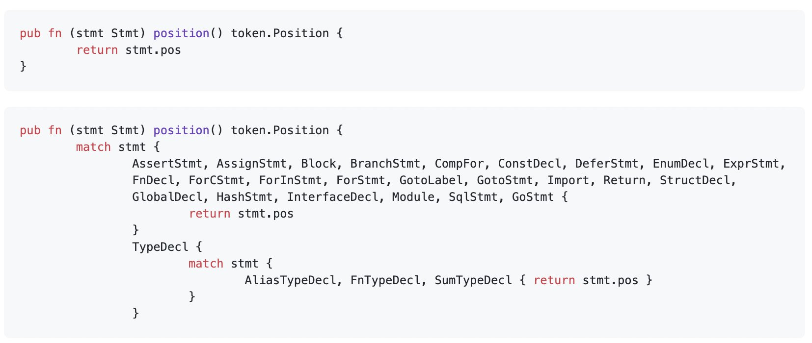

## 联合类型(sum types)

### 定义联合类型

V的联合类型在V编译器代码中大量采用。

有些使用接口的场景，不一定要全部用接口来实现，使用联合类型的代码看起来更简洁，清晰。

相对于go和rust来说，联合类型给V加分不少，用起来很舒服。

语法类似typescript，使用type 和 | 来定义一个联合类型：

```v
 //定义联合类型,表示类型Expr可以是这几种类型的其中一种
type Expr = Foo | BoolExpr |  BinExpr | UnaryExpr
```

使用pub关键字,定义公共的联合类型：

```v
pub type Expr = Foo | BoolExpr |  BinExpr | UnaryExpr
```

### 使用场景

联合类型相对于接口来说，比较适合于一个类型是已知的几种类型的其中一种，已知类型的数量是有限的，固定的，相对封闭的，不需要考虑未知类型的扩展性。

比如x.json2模块中，使用联合类型来包含所有json的节点类型，json节点类型种类是相对固定的，使用了联合类型这种数据结构来表示，后续的代码就变得很简洁清晰：

```v
//代码位置:vlib/x/json2/decoder.v
pub type Any = string | int | i64 | f32 | f64 | any_int | any_float | bool | Null | []Any | map[string]Any
```

还有另一个最大的场景就是V编译器自身，使用了联合类型来包含所有的AST抽象语法树的类型，毕竟AST的节点类型也是有限的，固定的，相对封闭的，后续AST的逻辑代码也变得简洁清晰很多：

```v
//代码位置:vlib/v/ast/ast.v
pub type TypeDecl = AliasTypeDecl | FnTypeDecl | SumTypeDecl | UnionSumTypeDecl

pub type Expr = AnonFn | ArrayInit | AsCast | Assoc | AtExpr | BoolLiteral | CTempVar |
	CallExpr | CastExpr | ChanInit | CharLiteral | Comment | ComptimeCall | ConcatExpr | EnumVal |
	FloatLiteral | Ident | IfExpr | IfGuardExpr | IndexExpr | InfixExpr | IntegerLiteral |
	Likely | LockExpr | MapInit | MatchExpr | None | OrExpr | ParExpr | PostfixExpr | PrefixExpr |
	RangeExpr | SelectExpr | SelectorExpr | SizeOf | SqlExpr | StringInterLiteral | StringLiteral |
	StructInit | Type | TypeOf | UnsafeExpr

pub type Stmt = AssertStmt | AssignStmt | Block | BranchStmt | CompFor | ConstDecl | DeferStmt |
	EnumDecl | ExprStmt | FnDecl | ForCStmt | ForInStmt | ForStmt | GlobalDecl | GoStmt |
	GotoLabel | GotoStmt | HashStmt | Import | InterfaceDecl | Module | Return | SqlStmt |
	StructDecl | TypeDecl
```

而接口更适合用来支持未知类型的扩展性。

### 使用联合类型

- 联合类型作为函数的参数或返回值，可以作为变量声明，结构体字段。
- 使用match语句，进行类型的进一步判断。
- 使用match语句，如果需要修改联合类型的值需要在变量前加mut。
- 使用is关键字联合类型具体是哪一种类型。
- 使用as关键字将联合类型转换为另一种类型，当然要转换的类型在联合类型定义的类型范围内。

```v
module main

struct User {
	name string
	age  int
}

fn (m &User) str() string {
	return 'name:$m.name,age:$m.age'
}

// 联合类型声明
type MySum = User | int | string

fn (ms MySum) str() string {
	if ms is int { // 使用is关键字,判断联合类型具体是哪种类型
		println('ms type is int')
	}
	match ms { // 对接收到的联合类型,使用match语句进行类型判断,每个match分支的ms变量都会被自动造型为分支中对应的类型
		int { return ms.str() }
		string { return ms }
		User { return ms.str() }
	}
}

fn add(ms MySum) { // 联合类型作为参数
	match ms { // 可以对接收到的联合类型,使用match语句进行类型判断,每个match分支的ms变量都会被自动造型为分支中对应的类型
		int { println('ms is int,value is $ms') }
		string { println('ms is string,value is $ms') }
		User { println('ms is User,value is $ms.str()') }
	}
}

fn sub(i int, s string, u User) MySum { // 联合类型作为返回值
	return i
	// return s //这个也可以
	// return User{name:'tom',age:3} //这个也可以
}

fn main() {
	i := 123
	s := 'abc'
	u := User{
		name: 'tom'
		age: 33
	}
	mut res := MySum{} // 声明联合类型变量
	res = i
	println(res) // 输出123
	res = s
	println(res) // 输出abc
	res = u
	println(res) // 输出name:tom,age:33
	match res { // 判断具体类型
		int { println('res is:$res.str()') }
		string { println('res is:$res') }
		User { println('res is:$res.str()') }
	}
	match mut res { // 如果需要在分支中修改res,需要加mut
		int {
			res = MySum(3)
			println('new res value is: $res')
		}
		string {
			res = 'abc'
			println('new res value is: $res')
		}
		User {
			res = User{
				name: 'jack'
				age: 12
			}
			println('new res value is:$res.str()')
		}
	}
	user := res as User // 也可以通过as,进行显示造型
	println(user.name)
	add(i)
	add(s)
}

```

### 获取联合类型的具体类型

联合类型使用内置方法type_name()来返回变量的具体类型。

```v
module main

struct Point {
	x int
}

type MySumType = Point | f32 | int

fn main() {
	// 联合类型使用type_name()
	sa := MySumType(32)
	sb := MySumType(f32(123.0))
	sc := MySumType(Point{
		x: 43
	})
	println(sa.type_name()) // int
	println(sb.type_name()) // f32
	println(sc.type_name()) // Point
}
```

### 联合类型相等判断

```v
type Str = string | ustring

struct Foo {
	v int
}

struct Bar {
	v int
}

type FooBar = Foo | Bar

fn main() {
	s1 := Str('s')
	s2 := Str('s')
	u1 := Str('s'.ustring())
	u2 := Str('s'.ustring())
	println( s1 == s1 ) //联合类型判断相等或不等:同类型,同值
	println( s1 == s2 )
	println( u1 == u1 )
	println( u1 == u2 )

    //类型不同,值相同也不等
	foo := FooBar( Foo{v: 0} )
	bar := FooBar( Bar{v: 0} )
	println( foo.v == bar.v )
	println( foo != bar )
}
```

### for is类型循环判断

用于联合类型的类型循环判断(感觉没啥用,就是一个语法糖而已)：

```v
module main

struct Milk {
mut:
	name string
}

struct Eggs {
mut:
	name string
}

type Food = Eggs | Milk

fn main() {
	mut f := Food(Eggs{'test'})
	//不带mut
	for f is Eggs {
		println(typeof(f).name)
		break
	}
	//等价于
	for {
		if f is Eggs {
			println(typeof(f).name)
			break
		}
	}
	//带mut
	for mut f is Eggs {
		f.name = 'eggs'
		println(f.name)
		break
	}
	//等价于
	for {
		if mut f is Eggs {
			f.name = 'eggs'
			println(f.name)
			break
		}
	}
}

```

### as类型转换

可以通过as将联合类型显式转换为具体的类型，如果转换类型不成功，则报错：V panic: as cast: cannot cast。

```v
module main

type Mysumtype = bool | f64 | int | string

fn main() {
	x := Mysumtype(3)
	x2 := x as int	//联合类型显式转换类型
	println(x2)
}
```

### 联合类型嵌套

联合类型还可以嵌套使用，支持更复杂的场景：

```v
struct FnDecl {
	pos int
}

struct StructDecl {
	pos int
}


struct IfExpr {
	pos int
}

struct IntegerLiteral {
	val string
}

type Expr = IfExpr | IntegerLiteral
type Stmt = FnDecl | StructDecl
type Node = Expr | Stmt //联合类型嵌套
```

### 联合类型方法

可以像结构体那样，给联合类型添加方法：

```v
module main

fn main() {
	mut m := Mysumtype{}
	m = int(11)
	println(m.str())
}

type Mysumtype = int | string

pub fn (mysum Mysumtype) str() string { // 联合类型的方法
	return 'from mysumtype'
}

```

### 泛型联合类型

联合类型也支持泛型的结合使用。

具体参考章节：[泛型](generic.md)

### 访问公共字段

联合类型可以在方法中访问所有类型的公共字段，并且支持联合类型的多级嵌套。

截图中是V编译器中的例子：stmt.pos是所有Stmt联合类型的公共字段，有了这个特性以后，代码就可以简洁到像截图中的第一个方法那样：



### 联合类型作为结构体字段

结构体字段的类型也可以是联合体类型：

```v
struct MyStruct {
	x int
}

struct MyStruct2 {
	y string
}

type MySumType = MyStruct | MyStruct2

struct Abc {
	bar MySumType // bar字段的类型也可以是联合类型
}

fn main() {
	x := Abc{
		bar: MyStruct{123}
	}
	if x.bar is MyStruct {
		println(x.bar)
	}
	match x.bar { // match匹配也可以使用
		MyStruct { println(x.bar.x) } // 也会自动造型为具体类型
		else {}
	}
}
```

### 子类不允许是指针类型

使用联合类型时，有一点需要注意：联合类型的子类中不允许出现指针类型，编译器会检查并报错。

```v
struct Abc {
    val string
}

struct Xyz {
    foo string
}

type Alphabet1 = Abc | string | &Xyz //不允许指针类型
```

